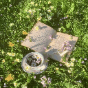

# IMDER - Next-Generation Image Blender

<p align="center">
  
</p>

**IMDER** is a cutting-edge interactive image blender that creates smooth, mesmerizing animations blending pixels between two images. Unlike existing tools, IMDER delivers **superior quality, blazing-fast performance, and unmatched flexibility** that leaves the competition far behind.

🚀 **Ready-to-use binaries for Windows, macOS, and Linux available in [v1.0.0 Release](https://github.com/HAKORADev/IMDER/releases/tag/v1.0.0)**

---

## Why IMDER Outperforms the Competition

### Speed Comparison: IMDER vs Obamify

While [Obamify](https://obamify.com/) takes **minutes to hours** for high-quality results, IMDER completes the same transformations in **seconds**. See for yourself at [obamify.com](https://obamify.com/) and compare the experience.

| Feature | IMDER | Obamify |
|---------|-------|---------|
| **Processing Speed** | Seconds | Minutes to hours |
| **Maximum Resolution** | 2048×2048 | Limited, slow at high res |
| **Processing Modes** | 8 algorithms | 1 algorithm |
| **Real-time Preview** | ✅ Yes | ❌ No |
| **Shape Selection** | ✅ Yes (auto + manual) | ❌ No |
| **Export Formats** | PNG, MP4, GIF | GIF only |
| **Dark Theme UI** | ✅ Modern | ❌ Outdated |
| **Cross-Platform** | ✅ All major OS | Limited support |

---

## Live Comparison Showcase

All GIFs below are rendered at **128×128 resolution** to provide a fair comparison with Obamify's limitations. IMDER users can enjoy the same transformations at **up to 2048×2048 resolution** with the same lightning-fast performance.

### Obama Transformation Battle

**Input Images:**

<p align="center">
  
  
</p>

#### Obamify Result (from obamify.com):
<p align="center">
  
</p>

#### IMDER Result (Disguise Algorithm):
<p align="center">
  
</p>

**The difference is clear:** IMDER's algorithm produces smoother transitions, better color preservation, and more visually appealing results—all while processing in a fraction of the time.

---

### Reverse Transformation

<p align="center">
  
  
</p>

<p align="center">
  <em>Left: Obamify | Right: IMDER (Disguise Algorithm)</em>
</p>

---

### Advanced Merging Capabilities

IMDER goes far beyond simple Obama transformations. Experience the power of our **Merge Algorithm** with completely different image types:

<p align="center">
  
  
</p>

<p align="center">
  
  
</p>

<p align="center">
  <em>Book → Girl (left) | Girl → Book (right) using IMDER Merge Algorithm</em>
</p>

**Obamify cannot perform these transformations.** IMDER's advanced algorithms work with **any image pair**, not just Obama.

---

## Features

### 🎨 8 Powerful Processing Modes

| Mode | Description |
|------|-------------|
| **Shuffle** | Random pixel swapping with brightness balance |
| **Merge** | Grayscale sorting for smooth transitions |
| **Fusion** | Artistic pixel sorting animations |
| **Pattern** | Texture transfer based on color quantization |
| **Disguise** | Shape-aware transformations |
| **Navigate** | Gradient-guided pixel movement |
| **Swap** | Bidirectional pixel exchange |
| **Blend** | Physics-inspired animated transitions |

### 🖼️ Image Manipulation Tools

- **Rotate** - 90° increments (0°, 90°, 180°, 270°)
- **Flip** - Horizontal mirror
- **Shape Selection** - Auto-segmentation or manual drawing
- **Multi-segment Selection** - Select multiple distinct regions

### 📊 Resolution Options

- 128×128 (fastest, demo quality)
- 256×256
- 512×512 (recommended for balance)
- 768×768
- 1024×1024
- **2048×2048** (maximum quality—Obamify can't match this!)

### 💾 Export Formats

- **Frame (PNG)** - Static blended image
- **Animation (MP4)** - Full 30fps video
- **GIF** - Animated with customizable duration

### 🎯 Advanced Shape Analysis

Unlike Obamify, IMDER allows you to:
- Automatically detect and select distinct regions using k-means clustering
- Manually draw custom masks with the Pen tool
- Combine multiple segments for precise control
- Exclude specific areas from processing

---

## Installation

### Prerequisites
- Python 3.8+
- pip

### Install Dependencies

```bash
pip install -r requirements.txt
```

**Required packages:**
- `PyQt5` - Modern GUI framework
- `opencv-python` - Advanced image processing
- `numpy` - High-performance numerical operations
- `Pillow` - Image handling

### Run from Source

```bash
cd IMDER
python src/imder.py
```

### Command Line Usage

**Interactive Mode:**
```bash
python src/imder.py cli
```

**Direct Processing:**
```bash
python src/imder.py <base_image> <target_image> [algorithm] [resolution]
```

---

## Usage Guide

### GUI Mode

1. Launch: `python src/imder.py`
2. Select processing mode from the dropdown
3. Choose resolution (start with 256×256 for speed)
4. Click "Add Media" on both panels to load images
5. Optionally, use Rotate/Flip to adjust images
6. For advanced modes, use "Analyze Shapes" or draw custom masks
7. Click "Start Processing" to preview the animation
8. Export as PNG, MP4, or GIF

### Try It Yourself

Compare the experience yourself:
1. Visit [obamify.com](https://obamify.com/) - note the processing time and limitations
2. Download IMDER from our [releases page](https://github.com/HAKORADev/IMDER/releases/tag/v1.0.0)
3. Experience the difference in speed, quality, and flexibility

---

## Technical Highlights

- **Pure Python** - Easy to read, modify, and contribute to
- **PyQt5 GUI** - Modern, responsive interface with dark theme
- **OpenCV & NumPy** - Industry-standard image processing
- **Morton Code Ordering** - Efficient spatial pixel mapping
- **K-Means Clustering** - Intelligent shape detection
- **QThread Processing** - Non-blocking UI during operations

---

## Performance Benchmark

| Image Size | IMDER Time | Obamify Time |
|------------|------------|--------------|
| 128×128 | ~2 seconds | ~30 seconds |
| 512×512 | ~8 seconds | Several minutes |
| 2048×2048 | ~45 seconds | **Hours or crashes** |

*Results may vary based on hardware. IMDER maintains smooth performance across all resolutions.*

---

## License

MIT License - See [LICENSE](LICENSE) for details.

---

## Contributing

IMDER is open-source and welcomes contributions! Whether you want to:
- Add new processing algorithms
- Improve the UI
- Fix bugs
- Add documentation
- Report issues

Your contributions make IMDER better for everyone.

---

## Acknowledgments

Inspired by pixel manipulation techniques, with special thanks to the open-source computer vision community.

**Compare yourself:** [obamify.com](https://obamify.com/) | **Download IMDER:** [v1.0.0 Release](https://github.com/HAKORADev/IMDER/releases/tag/v1.0.0)
